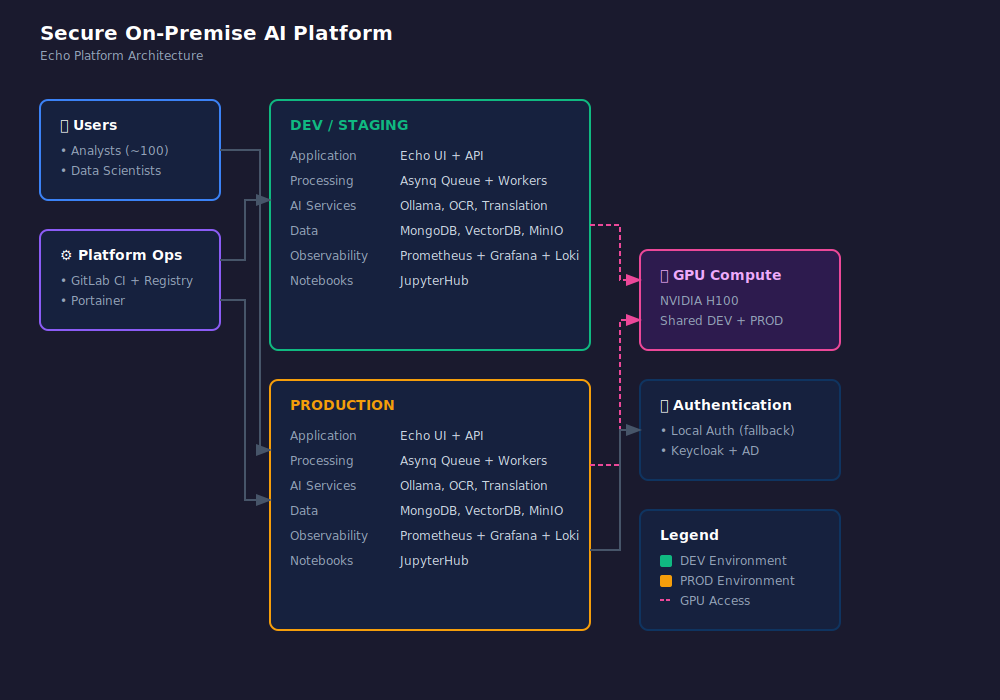

# Secure On-Premise AI Platform (Case Study) — Single H100, ~100 Users

## TL;DR (Key numbers)
- **Compute:** 1× **NVIDIA H100**, split across **two VMs** (DEV/STAGING + PROD)
- **Users:** ~**100** internal users on the main app (“Echo”)
- **Throughput:** ~**30× real-time** (≈ **1h audio in ~2 minutes**, workload dependent)
- **Guardrails:** ~**3–4 concurrent jobs**, **~3h max video**, **~50GB max file**
- **Constraints:** restricted/sensitive data **must stay on-prem** (cloud GPUs not viable)

This repository is **NDA-safe**: no proprietary code, no internal hostnames, no sensitive data sources.

---

## Quick navigation
- **Architecture diagram (primary):** [diagrams/architecture.svg](diagrams/architecture.svg)
- **Diagrams folder:** [diagrams/](diagrams/)
- **Operations runbook:** [runbook/operations.md](runbook/operations.md)
- **Deploy & release:** [runbook/deploy-release.md](runbook/deploy-release.md)
- **Incident playbook:** [runbook/incident-playbook.md](runbook/incident-playbook.md)

---

## Architecture (high level)

---

## Context
I built and operated an on-prem AI inference platform in a public-sector environment with strict compliance requirements.

Before this platform:
- We had a **CPU-only** cloud bare-metal server (no GPU capability).
- We had a **single in-office GPU workstation** used for development, not production.

This created a hard ceiling on:
- **Speed** (CPU-only for heavy workloads)
- **Cost efficiency** (CPU time at scale)
- **Confidentiality** (restricted/sensitive workloads could not leave the internal network)

---

## Goals
1. Enable **GPU-accelerated inference fully on-prem**.
2. Provide a reliable **self-serve app** for analysts: transcription + diarization + translation + summarization, with OCR for video.
3. Support two user modes:
   - **Non-technical users** via a UI
   - **Data scientists** via GPU-enabled notebooks
4. Keep operations sustainable with a small team: clear deploy/rollback, guardrails, and observability.

---

## Constraints (non-negotiable)
- **Data sovereignty:** restricted/sensitive data must remain within the internal network (cloud GPUs not acceptable).
- **Hardware constraint:** a **single H100** had to support multiple services + user workflows.
- **Operational simplicity:** Kubernetes migration was explored but not adopted—overhead didn’t match the environment.
- **Mixed workloads:** interactive analyst workflows + notebook jobs + background processing, all competing for GPU memory.

---

## Stack
**Orchestration**
- Docker **Compose** for most services
- Selective **Swarm** usage for specific multi-container stacks

**Deploy**
- GitLab CI builds images → pushes to **GitLab Registry**
- **Portainer** pulls and updates stacks (DEV/STAGING first, then PROD)

**Core runtime**
- Primary app: **Echo UI + API**
- Async jobs: **Asynq + Redis**, with **AsynqMon** for queue visibility
- Shared inference services: **Ollama (LLM API)** + standalone OCR/Translation APIs
- Data: **MongoDB** (auth + app data), **Vector DB(s)** (embeddings / RAG)
- Storage: **NFS** + integration with local **SMB** drives + **MinIO (S3-compatible)**
  - Artifacts stored with **short retention (TTL)**

**Observability**
- **Prometheus + Grafana + Loki** (plus app/queue visibility via AsynqMon)

**Auth**
- Local auth fallback
- Keycloak + AD integration where required

**Data science**
- **JupyterHub**: one container per user with persistent storage and controlled GPU access

---

## System overview
The platform is built as composable services (“bricks”) plus one main end-user application.

- **Echo (main app)**
  - Web UI for transcription + diarization + translation + summarization
  - Optional OCR when input is video
  - Auth, admin controls, basic metrics

- **Task queue + workers**
  - Asynchronous job handling using Asynq (Redis)
  - Worker containers per pipeline step (ASR, diarization, OCR, translation, summarization)

- **Shared inference services**
  - Central Ollama API for LLM-based tasks
  - Standalone OCR and translation APIs
  - Additional specialized pipelines composed from these bricks

- **JupyterHub**
  - GPU-enabled notebooks for data scientists
  - One container per user, persistent storage
  - Policies to reduce contention with production workloads

---

## Deployment model (CI/CD + ops)
Release flow is designed for simplicity and reliability:

1. Push to GitLab  
2. GitLab CI builds images and publishes to registry (immutable tags)  
3. Portainer pulls and updates stacks  
4. DEV/STAGING validation → PROD promotion  
5. Rollback = revert to prior immutable image tags

Details: [runbook/deploy-release.md](runbook/deploy-release.md)

---

## Performance & guardrails
- **Users:** ~100 internal users
- **Throughput:** ~30× real-time audio processing (≈ 1h in ~2 minutes)
- **Hard limits (stability guardrails):**
  - Max concurrent jobs: **~3–4**
  - Max video length: **~3 hours**
  - Max file size: **~50 GB**
  - Short-lived artifacts with TTL to prevent storage growth

These limits are intentional: single GPU + mixed workloads means stability is engineered with guardrails, not wishful thinking.

---

## What went wrong (and what I did about it)

### 1) OOM and VRAM fragmentation
**Symptoms**
- Jobs failing under load even when VRAM seemed “available”
- Workers restarting or failing mid-run

**Root causes**
- Fragmentation patterns from mixed workloads + repeated allocations
- Uncontrolled concurrency across services

**Mitigations**
- Explicit concurrency caps and admission control
- Worker-level discipline (batch sizing / model load patterns)
- Recovery runbooks (restart patterns that avoid reload storms)

### 2) GPU contention across services
**Symptoms**
- Latency spikes and unpredictable throughput
- Queue backlog growing during peak use

**Reality**
- Fine-grained per-service GPU reservation is limited when you only have one physical card and multiple independent workloads.

**Mitigations**
- Guardrails on concurrency and file sizes
- Prioritization policies (interactive workflows over batch jobs)
- Visibility (queue depth + job latency) so users see “why it’s slow”

**Long-term fix**
- More GPUs/nodes so services can be pinned and load-balanced properly. Hardware solves what orchestration can’t.

### 3) JupyterHub notebook VRAM contention (data science vs production)
**Symptoms**
- Notebook jobs failing due to VRAM pressure during peak usage
- Interference between notebooks and production inference pipelines

**Fix**
- Designed a dynamic **TTL + load-balancing** strategy to manage contention across user containers:
  - Time-bounded GPU-heavy notebook activity
  - Scheduling/rotation policies to reduce simultaneous peaks
  - Protect production workloads via prioritization and concurrency controls

**Result**
- Fewer VRAM-related notebook failures and a more predictable production experience under shared-GPU constraints.

---

## Team model
I acted as the **sole platform/infrastructure engineer**:
- architecture, deploy, operations, reliability, and performance ownership
- day-to-day technical leadership for ~3 data scientists
- converting notebook prototypes into production services (auth, queueing, observability, guardrails)

Data scientists:
- developed analysis prototypes in notebooks for internal requests
- validated model behavior and supported iteration on use cases

---

## Why this matters (transferable value)
- **Queueing + prioritization** under constrained resources
- **Reliability under load** (degraded mode beats “down”)
- **Auditability / traceability** (what ran, when, on what inputs)
- **Guardrails** that keep systems stable even when users push limits
- **Operational clarity**: release discipline, rollbacks, and incident playbooks

In short: this is “production under constraints,” which is the daily reality in real-world flow analytics and trading operations.

---

## What I’d do next
1. Add GPUs/nodes to eliminate contention as a class of failures.
2. Introduce explicit scheduling policies (priority queues; preemption where safe).
3. Harden observability around GPU memory behavior and queue dynamics.
4. Standardize a small internal “pipeline SDK” to reduce prototype-to-prod friction.
5. Formalize artifact retention policies per workflow (TTL tiers) to balance traceability vs storage.

---

## NDA note
This case study intentionally avoids:
- internal names, hostnames, URLs, screenshots
- proprietary prompts, configs, code, or sensitive data sources
